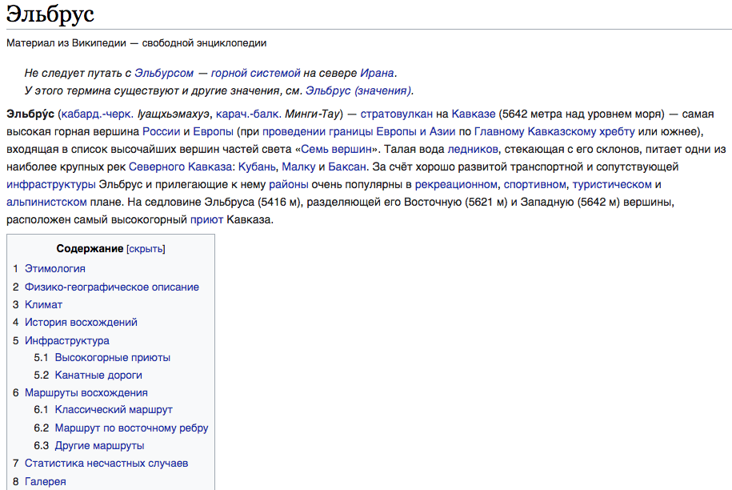

## Меню навигации.

Вы много раз сталкивались с меню навигации по html-странице. Вспомните, например, википедию. В начале каждой статьи у вас есть "содержание", каждый пункт которого является ссылкой на соответствующий раздел. При нажатии на ссылку страница прокручивается до нужного вам раздела в статье. Скорее всего вы уже догадались, что вам предстоит сделать в этом задании. Меню навигации по странице! То есть такое же оглавление с ссылками на разделы.

<kbd>
	
</kbd>

*Для выполнения задания вам необходимо подробнее изучить работу ссылок `<a>` и познакомиться с так называемыми [якорями](http://htmlbook.ru/samhtml/yakorya).*

## Релиз 0.
Наполните страницу большим количеством информации так, чтобы ее можно было прокручивать вниз (для наглядности). За основу можете взять ранее написанную вами газету. Теперь добавьте в верхней части html-страницы меню навигации в виде списка, каждый пункт которого соответствует какому либо разделу html-страницы. При нажатии на пункт меню, пользователя должно перекидывать к соответствующему разделу. Результат сохраните в файл `navigation.html`.

## Релиз 1.
Внесем изменения в нашу навигацию. Давайте сделаем копию нашего html-файла. А теперь вынесем каждый раздел в отдельный html-файл. Соответственно, нам нужно изменить навигацию, чтобы нас перенаправляло на другие страницы, а не на разделы текущей. Файлы можно называть как угодно, но должно быть понятно что к чему относится.